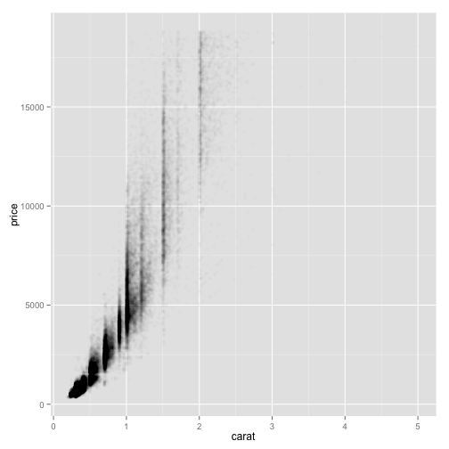
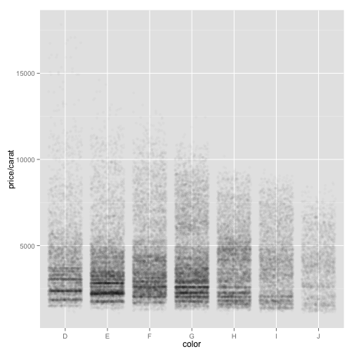
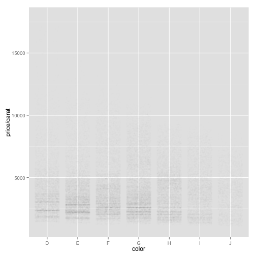
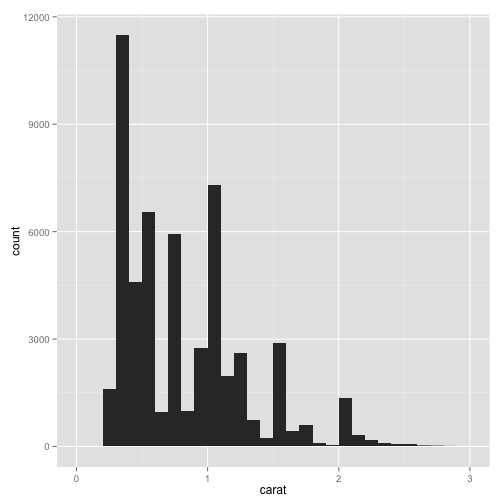
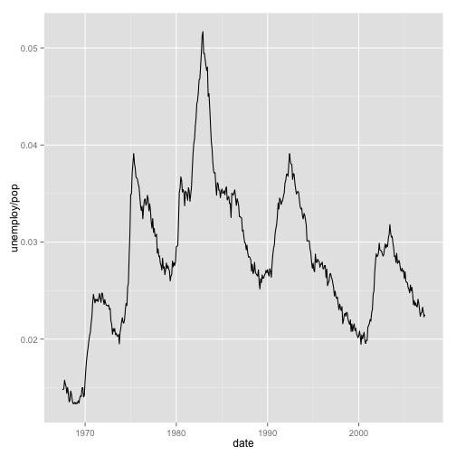
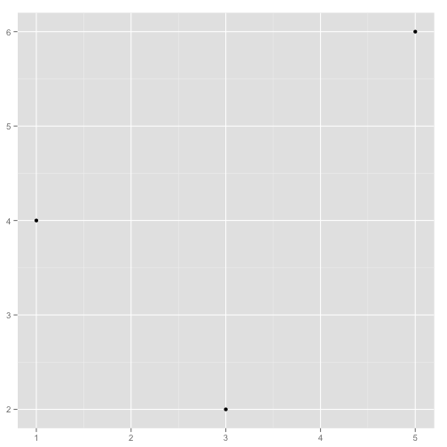
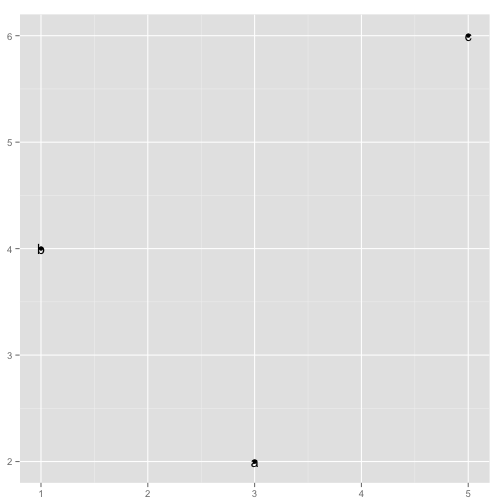

Title
========================================================

This is an R Markdown document. Markdown is a simple formatting syntax for authoring web pages (click the **Help** toolbar button for more details on using R Markdown).

When you click the **Knit HTML** button a web page will be generated that includes both content as well as the output of any embedded R code chunks within the document. You can embed an R code chunk like this:


```r
summary(cars)
```

```
##      speed           dist    
##  Min.   : 4.0   Min.   :  2  
##  1st Qu.:12.0   1st Qu.: 26  
##  Median :15.0   Median : 36  
##  Mean   :15.4   Mean   : 43  
##  3rd Qu.:19.0   3rd Qu.: 56  
##  Max.   :25.0   Max.   :120
```


You can also embed plots, for example:


```r
plot(cars)
```


And some plots constructed while teaching myself ggplot2.


```r
library(ggplot2)

set.seed(1410)
dsmall = diamonds[sample(nrow(diamonds), 100), ]

qplot(carat, price, data = diamonds)
```


```r
qplot(log(carat), log(price), data = diamonds)
```


```r
qplot(carat, x * y * z, data = diamonds)
```


```r
qplot(carat, price, data = dsmall, color = color)
```


```r
qplot(carat, price, data = dsmall, shape = cut)
```


```r
qplot(carat, price, data = diamonds, alpha = I(1/10))
```


```r
qplot(carat, price, data = diamonds, alpha = I(1/100))
```



```r
qplot(carat, price, data = diamonds, alpha = I(1/200))
```


```r
# color and shape work well for categorical values, size works well for
# continuous variables
qplot(carat, price, data = dsmall, geom = c("point", "smooth"))
```

```
## geom_smooth: method="auto" and size of largest group is <1000, so using loess. Use 'method = x' to change the smoothing method.
```


```r
qplot(carat, price, data = diamonds, geom = c("point", "smooth"))
```

```
## geom_smooth: method="auto" and size of largest group is >=1000, so using gam with formula: y ~ s(x, bs = "cs"). Use 'method = x' to change the smoothing method.
```


```r
qplot(carat, price, data = dsmall, geom = c("point", "smooth"), span = 0.2)
```

```
## geom_smooth: method="auto" and size of largest group is <1000, so using loess. Use 'method = x' to change the smoothing method.
```


```r
qplot(carat, price, data = dsmall, geom = c("point", "smooth"), span = 1)
```

```
## geom_smooth: method="auto" and size of largest group is <1000, so using loess. Use 'method = x' to change the smoothing method.
```


```r

library(mgcv)
qplot(carat, price, data = dsmall, geom = c("point", "smooth"), method = "gam", 
    formula = y ~ s(x))
```


```r
qplot(carat, price, data = dsmall, geom = c("point", "smooth"), method = "gam", 
    formula = y ~ s(x, bs = "cs"))
```


```r

library(splines)
qplot(carat, price, data = dsmall, geom = c("point", "smooth"), method = "lm")
```


```r
qplot(carat, price, data = dsmall, geom = c("point", "smooth"), method = "lm", 
    formula = y ~ ns(x, 5))
```


```r

library(MASS)
qplot(carat, price, data = dsmall, geom = c("point", "smooth"), method = "rlm")
```


```r

qplot(color, price/carat, data = diamonds, geom = "boxplot")
```


```r
qplot(color, price/carat, data = diamonds, geom = "jitter", alpha = I(1/5))
```


```r
qplot(color, price/carat, data = diamonds, geom = "jitter", alpha = I(1/50))
```



```r
qplot(color, price/carat, data = diamonds, geom = "jitter", alpha = I(1/200))
```



```r

qplot(carat, data = diamonds, geom = "histogram")
```

```
## stat_bin: binwidth defaulted to range/30. Use 'binwidth = x' to adjust this.
```


```r
qplot(carat, data = diamonds, geom = "density")
```


```r
qplot(carat, data = diamonds, geom = "histogram", binwidth = 1, xlim = c(0, 
    3))
```


```r
qplot(carat, data = diamonds, geom = "histogram", binwidth = 0.1, xlim = c(0, 
    3))
```



```r
qplot(carat, data = diamonds, geom = "histogram", binwidth = 0.01, xlim = c(0, 
    3))
```

```
## Warning: position_stack requires constant width: output may be incorrect
```


```r
qplot(carat, data = diamonds, geom = "histogram", fill = color)
```

```
## stat_bin: binwidth defaulted to range/30. Use 'binwidth = x' to adjust this.
```


```r
qplot(carat, data = diamonds, geom = "density", color = color)
```


```r

qplot(color, data = diamonds, geom = "bar")
```


```r
qplot(color, data = diamonds, geom = "bar", weight = carat) + scale_y_continuous("carat")
```


```r

qplot(date, unemploy/pop, data = economics, geom = "line")
```



```r
qplot(date, uempmed, data = economics, geom = "line")
```


```r

str(economics)
```

```
## 'data.frame':	478 obs. of  6 variables:
##  $ date    : Date, format: "1967-06-30" "1967-07-31" ...
##  $ pce     : num  508 511 517 513 518 ...
##  $ pop     : int  198712 198911 199113 199311 199498 199657 199808 199920 200056 200208 ...
##  $ psavert : num  9.8 9.8 9 9.8 9.7 9.4 9 9.5 8.9 9.6 ...
##  $ uempmed : num  4.5 4.7 4.6 4.9 4.7 4.8 5.1 4.5 4.1 4.6 ...
##  $ unemploy: int  2944 2945 2958 3143 3066 3018 2878 3001 2877 2709 ...
```

```r

df <- data.frame(x = c(3, 1, 5), y = c(2, 4, 6), label = c("a", "b", "c"))
p <- ggplot(df, aes(x, y, label = label)) + xlab(NULL) + ylab(NULL)
p + geom_point()
```



```r
p + geom_point() + geom_text()
```



```r
p + geom_text()
```


```r
p + geom_bar(stat = "identity")
```


```r

library(maps)
data(us.cities)
big_cities <- subset(us.cities, pop > 5e+05)
map <- qplot(long, lat, data = big_cities)
map + borders("state", size = 0.5)
```


